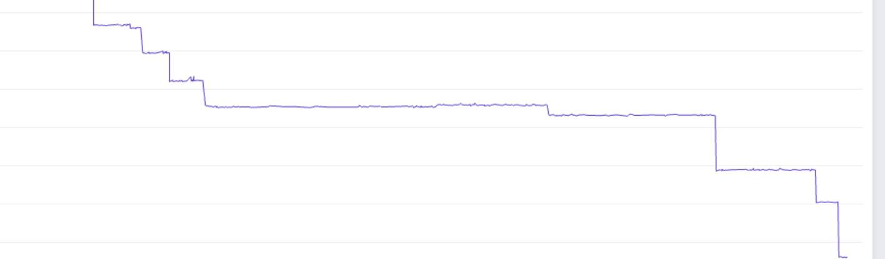

> **TL;DR** – A regression report revealed that
> exporting a model with many unbacked (data-dependent) symbols took
> **264s**.  Profiling showed the latency was dominated by
> repeated symbolic reasoning in the shape system.  A series of targeted,
> generally applicable optimizations reduced tracing time to **87s** (~3x
> faster).

## Background

A report indicated a severe slowdown when exporting a model that heavily
uses data-dependent operations (i.e., unbacked symbolic shapes).  Profiling
showed that most of the time was spent inside the symbolic shape system.

At the time of investigation, `torch.export` did not support profiling
out of the box, which made root-cause analysis difficult.  After
[enabling profiling for export](https://github.com/pytorch/pytorch/pull/174606),
a local [reproduction](https://github.com/pytorch/pytorch/pull/174620) was
created to mimic the model's behavior and allow faster iteration.

Examining the profile revealed several broadly applicable optimization
opportunities, particularly for unbacked symbols.  Eight optimizations
were implemented, resulting in an overall **~3x reduction in export time**,
from **264s to 87s**.

## Patterns

One key pattern is checking `u0 >= 0`, which we do whenever we allocate an
unbacked size.  Similarly, checks like `u0 == 0`, `u0 == 1`, `u0 > 0`,
`u0 >= 2` are common 0/1 comparisons against unbacked expressions.  These
patterns also extend to composite expressions (e.g., sums of symbols
produced by concatenations).

These are evaluated repeatedly across retraces of the graph.  Many of the
optimizations below target these common patterns.

## The optimizations

### 1. Config: `aggressive_guard_free_semantics`

When using `guard_or_false` and `guard_or_true`, we always have a safe
fallback value that we can take, and the question is how much effort we
want to spend doing static reasoning before we fall back to true/false.

This PR adds a config with three levels, saving 20–30s on top of other
optimizations:

- **Level 0** (default): Full static evaluation
- **Level 1**: Only apply replacements (implicit via `.expr` access) and
  do value range analysis
- **Level 2**: Only apply replacements, skip range analysis entirely

### 2. Config: `do_not_emit_stack_traces` ([PR #175423](https://github.com/pytorch/pytorch/pull/175423))

Skip collecting stack traces during FX tracing.  Trades debuggability for
speed.  **8% improvement.**

### 3. Cache `SymNode.expr` ([PR #175353](https://github.com/pytorch/pytorch/pull/175353))

The `SymNode.expr` property invoked `shape_env.replace()` on every access,
even when the replacement mapping had not changed.  Since this property is
accessed **very** frequently during tracing, the repeated recomputation
became a significant cost.

A per-SymNode cache was added that is invalidated only when replacements
change (tracked via a version counter).  **9% improvement.**

### 4. Optimize `_smart_symbol_sort` hint access ([PR #174655](https://github.com/pytorch/pytorch/pull/174655))

`_smart_symbol_sort` previously called `size_hint()` on individual symbols
to extract values from `backed_var_to_val`.  However, `size_hint()`
performed more complex and expensive reasoning, especially for unbacked
symbols.  A direct dictionary lookup into `backed_var_to_val` was
sufficient.  **8% improvement.**

### 5. Skip sympy evaluation for single unbacked symbol vs. constant ([PR #174662](https://github.com/pytorch/pytorch/pull/174662))

Constructing relational expressions like `u0 >= 0`, `u0 == 1` where one
side is an unbacked symbol and the other is a constant triggered expensive
sympy evaluation.  Since unbacked symbols have no assumptions, there's
nothing to simplify.  Using `evaluate=False` skips this unnecessary work.
**15% improvement.**

### 6. Avoid redundant `compute_hint()` calls during expression construction ([PR #174664](https://github.com/pytorch/pytorch/pull/174664))

When `SymNode` operations produce results with unavailable hints, passing
`None` to `SymNode.__init__` caused it to retry expensive `compute_hint()`
for no reason — it will fail.  A sentinel value now explicitly indicates
"hint unavailable, don't recompute."  **7% improvement.**

### 7. Skip static eval for unbounded unbacked symbols ([PR #174652](https://github.com/pytorch/pytorch/pull/174652))

In `guard_or_defer_runtime_assert`, evaluating `u0 >= 0` when `u0` has
range `[-∞, ∞]` is pointless — the purpose of the evaluation is to decide
if we can early exit, but if the range is `(-inf, inf)`, there's nothing
to determine yet.  The first call updates the range; subsequent calls with
range `[0, ∞]` will be fast due to the earlier optimization.

### 8. Use `sympy.Add._from_args` in `make_optimized` ([PR #174665](https://github.com/pytorch/pytorch/pull/174665))

`sympy.Add(*args, evaluate=False)` internally iterates over all args twice
performing redundant computations.  Using `_from_args` directly with
`is_commutative=True` saves **5% improvement.**

## Process takeaways

1. **Profile before optimizing** — Profiling was essential to
   identify the actual bottlenecks.  Without it, we would have been
   guessing.
2. **Know your patterns** — Understanding that `u0 >= 0` and similar
   checks are ubiquitous for unbacked symbols led to targeted fast paths
   with big impact.
3. **Invest in repro infrastructure** — Adding a benchmark
   (`unbind_split_flip_cat.py`) enabled fast local iteration and will
   catch future regressions.
4. **Small wins compound** — No single optimization was a silver bullet.
   Eight optimizations of 5–15% each combined to ~3x overall improvement.

## Technical takeaways

1. **Symbolic reasoning is expensive** — symbolic evaluation, even for
   trivial expressions, adds up quickly when called thousands of times.
   Avoid it when possible: don't use it trivially as a cheap early exit
   (it's not cheap), don't call it when you already know there's no
   answer, use `evaluate=False` for trivial expressions, and cache results
   when possible.
2. **Avoid redundant compute on hot paths** — The `SymNode.expr` cache
   and `_NO_HINT` sentinel show that avoiding redundant computation pays
   off, especially in hot paths.
3. **Configs for trade-offs** — `aggressive_guard_free_semantics` and
   `do_not_emit_stack_traces` let users trade correctness/debuggability
   for speed when appropriate.

## References

- [`torch/fx/experimental/symbolic_shapes.py`](../../../torch/fx/experimental/symbolic_shapes.py) — symbolic shape infrastructure
- [`torch/fx/experimental/sym_node.py`](../../../torch/fx/experimental/sym_node.py) — SymNode implementation
- [Profiling for export PR #174606](https://github.com/pytorch/pytorch/pull/174606)
- [Local reproduction PR #174620](https://github.com/pytorch/pytorch/pull/174620)
